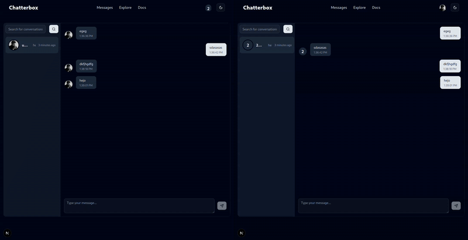

[]()
[]()
[]()
[]()
[]()
[]()
[]()
[]()
[]()
[]()
[]()
[]()


# Chatterbox

Simple `chat web app` writted with microservices (simplified **CQRS** pattern and event-driven architecture). Microservices communicate with each other by RabbitMQ broker. 

## Getting started

Before we start copy `.env.sample` in the root of the project and fill blank keys. You also need to do it with other services.

```bash
cp .env.sample .env
```

> [!TIP]
> To generate .env's just use `init.sh`!

```bash
bash init.sh
```

or

```bash
sudo chmod +x init.sh
./init.sh
```

Just make sure you have installed `Docker`, `docker-compose`.

```bash
docker-compose up -d
```

## Features

- Real time communication if both of users are **online**

- Simple notification system. Provides sending emails and getting real time notifications when user is online.

- System to track online status.

- Simple account managment.


## Services

Check services to get know how does it works!

- [`Profile Service`](profile_service)

- [`Auth Service`](auth_service)

- [`Notification Service`](notification_service)

- [`Chat Service`](chat_service)

- [`Status Service`](status_service)

## Examples

### Edit Account  
  
The user updates their account details, such as username and profile picture.

### Getting Notification  
  
An example of receiving a real-time notification after an action is triggered in the system.

### Sample Flow  
  
A example user flow through several application screens – from home view through explorer for people to chat where sends message. 

### Continue With Google
  
Demonstration of logging in via Single Sign-On for seamless access.

### Live Chatting  
  
Real-time chat functionality between users, showing message sending and receiving.

### Profile and Notifications  
  
The user navigates to their profile and checks their recent notifications.


### Go to Offline mode
  
The user logs out and finds his profile to check is online or offline.
